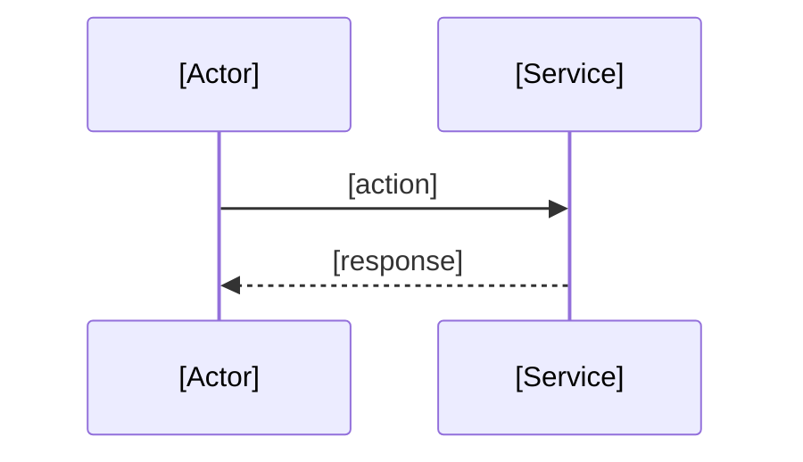

# [Feature Name]

**Status:** draft | active | shipped | deprecated
**Owner:** @[handle]
**Last updated:** YYYY-MM-DD

## Overview

<!-- What this feature is, who it's for, and why it exists. -->

## Requirements

### Functional Requirements

<!-- What the feature must do. Each requirement can be a one-liner or expanded with context, edge cases, and acceptance criteria as needed. -->

### [Requirement Name]

<!-- Use a subsection when a requirement needs more detail. -->

**Acceptance Criteria:**

- [Concrete, verifiable condition]

### Non-functional Requirements

<!-- Performance, scalability, security, reliability constraints. -->

## Data Model (Optional)

<!-- Key entities and relationships. Concepts over field-by-field schemas. -->

## Flows

<!-- One subsection per distinct operation. Include success and failure paths. -->

### [Flow Name]

## Boundaries (Optional)

<!-- Where this feature starts and stops. -->

### Owns

- [What this feature is responsible for]

### Does NOT own

- [What is handled elsewhere] — owned by [where]

### Adjacent Specs

- [[Related Feature]](../related-feature/spec.md) — how it connects

## Technical Decisions

<!-- Feature-scoped implementation choices. Link to ADRs for system-wide decisions. -->

### [Decision Title]

**Chose:** [X] — **Over:** [Y, Z]
**Rationale:**

## Open Points (Optional)

<!-- Unresolved decisions. Move to relevant sections when resolved. -->

- [Question] — context and options being considered

## Known Issues (Optional)

<!-- Gaps discovered during development. Remove when fixed. -->

- [Issue] — context, impact, and planned resolution

## Notes and References (Optional)

- [Useful notes, links, and references]
