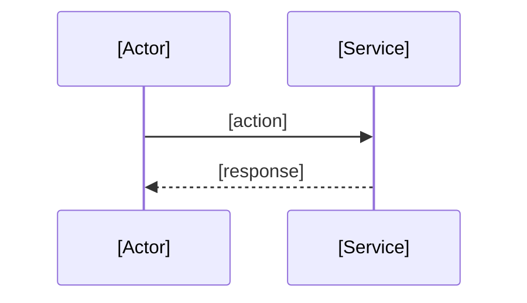

# [Feature Name]

**Status:** draft | active | shipped | deprecated  
**Owner:** @[handle]  
**Last updated:** YYYY-MM-DD

## Overview

<!--
What this feature is and why it exists.
2-5 sentences covering the problem, target users, and high-level behavior.
Someone reading only this section should understand the feature's purpose.
-->

## Design Principles

<!--
Core concepts that shape this feature's design.
Each principle should balance product needs and technical feasibility.
For each principle, include:
- A short concept explanation
- Functional requirements
- Non-functional requirements
- Rationale and trade-offs
-->

### [Principle Name]

<!--
Explain the concept: what it is, how it works, and its role in this feature.
Keep this to one paragraph focused on the idea, not implementation details.
-->

**Functional Requirements:**

- [Business rules and behaviors this concept must satisfy]

**Non-functional Requirements:**

- [Performance, scalability, security constraints if applicable]

**Rationale:**

<!--
Why this approach was chosen over alternatives and what trade-offs were accepted.
-->

## Data Model (Optional)

<!--
How the main entities relate to each other.
Describe concepts and relationships, not field-by-field implementation.
You may include schema snippets and data model diagrams.
-->

## Flows

<!--
Key actions in this feature.
Each flow should describe one distinct operation (user-triggered, event-driven,
cron, or service-to-service), including success and failure paths.
-->

### [Flow Name]

#### Sequence Diagram

<!--
Show actor interactions (user, service, database, external API), order of
operations, and returned outcomes.
-->

#### Flowchart (Optional)

<!--
Add only when branching logic is complex and a sequence diagram is not enough.
-->

## Boundaries (Optional)

<!--
Define where this feature starts and stops to prevent scope creep and to help
engineers find the right spec near system boundaries.
-->

### Owns

- [What this feature is responsible for]

### Does NOT own

- [What is handled elsewhere] - owned by [where]

### Adjacent Specs

- [[Related Feature]](../related-feature/spec.md) - how it connects

## Technical Decisions

<!--
Feature-level implementation choices (storage format, queue vs cron, caching,
etc.) that can change without redefining the feature's design.
For system-wide choices (framework, infrastructure, protocol), link to
/docs/adrs/.
-->

### [Decision Title]

<!-- Similar to ADRs, but scoped to this feature. -->

**Chose:** [X] - **Over:** [Y, Z]  
**Rationale:**

<!-- Why this choice was made and what trade-off was accepted. -->

## Changelog

- [YYYY-MM-DD] - [Brief description of change]

## Iteration Notes (Optional)

<!--
Use this section only to link significant iteration records.
Store detailed iteration writeups in:
`docs/specs/<feature-id>/iterations/YYYY-MM-DD.md`
Keep this spec as the current source of truth; do not move core decisions out.
-->

- [YYYY-MM-DD](./iterations/YYYY-MM-DD.md) - [Why this iteration happened and what changed]

## Open Points (Optional)

<!--
Decisions not yet made.
When resolved, remove from here and move the outcome into the relevant section
above to keep the spec current.
-->

- [Question] - context and options being considered

## Known Issues (Optional)

<!--
Problems or gaps discovered during development.
Keep entries here until fixed.
-->

- [Issue] - context, impact, and planned resolution (if any)

## Notes and References (Optional)

<!--
Useful implementation notes: key files, gotchas, setup steps, diagrams,
important PRs, and external docs.
-->

- [Useful notes, links, and references]
