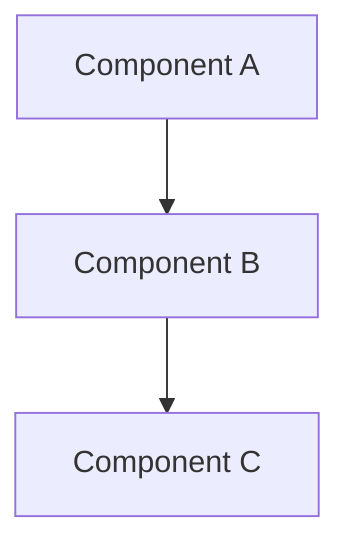

# [System/Project Name] — System Design

**Status:** draft | active | shipped | deprecated
**Owner:** @[handle]
**Last updated:** YYYY-MM-DD

<!-- High-level system design: architecture, tech stack, components, cross-cutting concerns. -->

## Mission

<!-- What the system does, who it serves, why it exists. -->

## Design Principles

<!-- Opinionated principles that break ties between valid approaches. Not generic truisms. -->

- [Principle] — [why it matters for this system]

## Tech Stack

| Layer | Technology | Notes |
|---|---|---|
| Runtime | [e.g. Node.js 20] | [version or constraints] |
| Language | [e.g. TypeScript] | [strictness, conventions] |
| Data | [e.g. PostgreSQL 16] | [primary use case] |
| Infra | [e.g. Docker, Railway] | [deployment context] |

## Architecture

<!-- Components, boundaries, and how they communicate. -->

### [Component Name]

<!-- What it owns, exposes, and depends on. -->

## External Dependencies

<!-- Third-party services and APIs: purpose and failure behavior. -->

- [Service/API] — [purpose and failure behavior]

## Cross-Cutting Concerns

### Security

<!-- What the system trusts, where it is exposed, what gaps exist, what the plan is. -->

#### Assumptions

- [Assumption] — [what breaks if wrong]

#### Known Gaps and Risks

| Gap | Severity | Impact | Root Cause | Mitigation / Acceptance |
|---|---|---|---|---|
| [e.g. No rate limiting on public API] | high | DoS risk on auth service | Not yet implemented | Planned for v1.1; WAF provides partial coverage |

#### Controls

- [Control] — [what it protects and how]

### Data Architecture (Optional)

### Observability (Optional)

### Performance and Scalability (Optional)

### Error Handling and Resilience (Optional)

## Constraints

<!-- Givens that shape the architecture. -->

- [Constraint] — [how it shapes the architecture]

## Architecture Rationale (Optional)

<!-- Why the system is shaped this way. Connects ADRs into a narrative. -->

## Open Points (Optional)

<!-- Unresolved architecture decisions. -->

- [Question] — context and options being considered

## Related Documents (Optional)

- [PRD](../prd.md) — product requirements this design implements
- [Codebase Summary](../codebase-summary.md) — repository layout
- [Rules](../rules/README.md) — engineering standards
- [ADRs](../adrs/README.md) — architecture decisions
